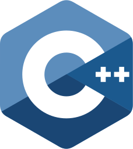
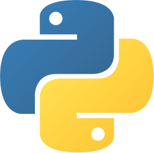

<div align="center">

# 👋 Hi, I'm [M1ndPuttY](https://M1ndPuttY.github.io/Docsify-Guide/#/)

---

## 先祝你每天开心 🌸

---


---

### 💻 Technologies I Love

**Linux** · **Embedded** · **Machine Learning**

---

### ⚡ Programming Languages







---

### 🛠 Tools & Technologies


---

### 📊 GitHub Stats


---

### 📝 Who Am I?

```c
#include <stdio.h>

struct WhoAmI {
    char *user;
    char *current_work;
    char *hobbies[4];
};

char* getcity() {
    return "XIAN_CHINA";
}

int main() {
    struct WhoAmI me = {
        .user = "wangzhao",
        .current_work = "Writing code",
        .hobbies = {
            "Model making",
            "Watching Anime",
            "Motorcycle",
            "Bicycle"
        }
    };

    char* Ambitions[3];
    Ambitions[0] = "Learn English";
    Ambitions[1] = "Practice photography";
    Ambitions[2] = "Be Well";

    return 0;
}
```

---

### 🤖 Current Focus

**Artificial Intelligence & Machine Learning**

---

### 🏁 Connect With Me

[](https://www.cnblogs.com/passive/)
[](https://M1ndPuttY.github.io/Docsify-Guide/#/)

---

<em>the world's full of lonely people afraid to make the first move.</em>

---

</div>
